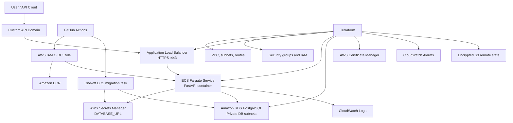
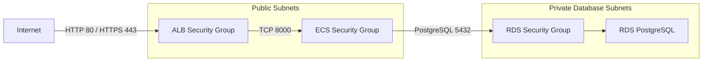
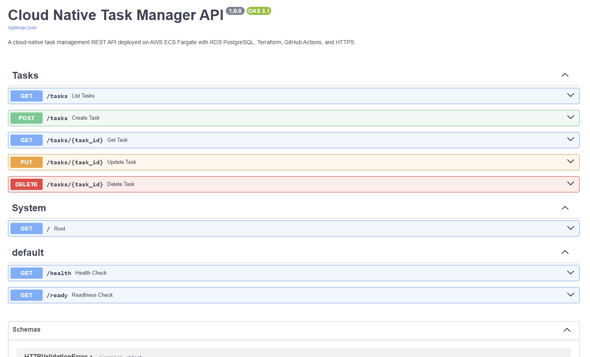
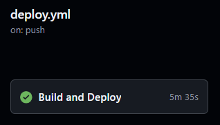
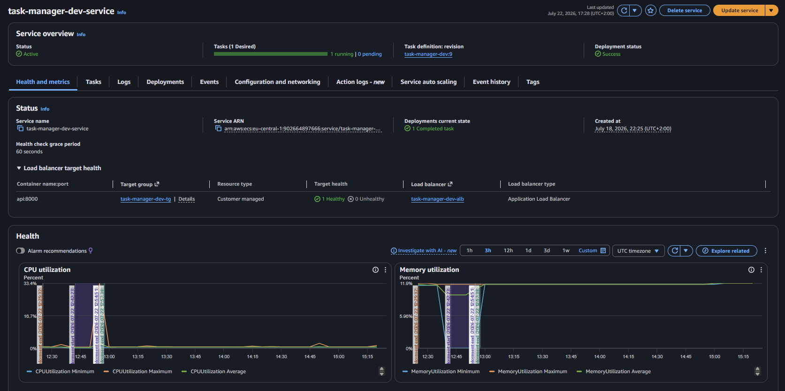
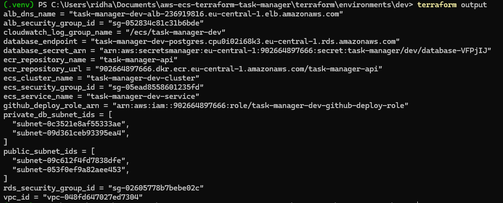
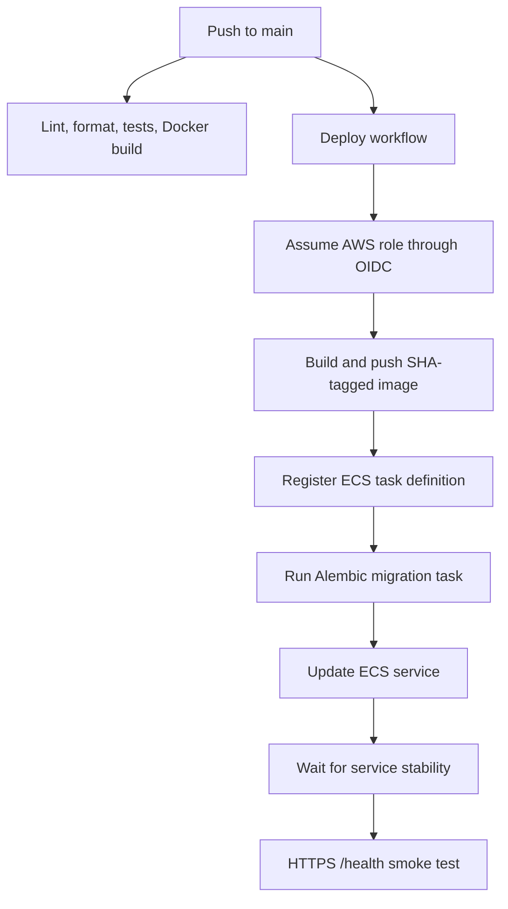

# Cloud-Native Task Manager on AWS

[](https://github.com/ridhampansara27/aws-ecs-terraform-task-manager/actions/workflows/ci.yml)
[](https://github.com/ridhampansara27/aws-ecs-terraform-task-manager/actions/workflows/deploy.yml)


A production-inspired task management REST API that demonstrates an end-to-end cloud engineering workflow on AWS: application development, containerization, Infrastructure as Code, secure CI/CD, database migrations, monitoring, HTTPS, and cost-aware operations.

> [!IMPORTANT]
> This is a cost-controlled development environment. ECS and RDS may be paused when the project is not being demonstrated. The screenshots and deployment workflows provide evidence of the running environment when the live API is offline.

## Deployed API

| Resource | URL |
|---|---|
| API root | <https://api.ridham-pansara-portfolio.online/> |
| Swagger UI | <https://api.ridham-pansara-portfolio.online/docs> |
| ReDoc | <https://api.ridham-pansara-portfolio.online/redoc> |
| Health check | <https://api.ridham-pansara-portfolio.online/health> |
| Readiness check | <https://api.ridham-pansara-portfolio.online/ready> |

> **Live environment:** The AWS runtime is normally scaled to zero to control personal cloud costs. The API can be started on demand; the evidence section below documents the deployed and operational environment.

## Skills Demonstrated

| Skill area | Implementation |
|---|---|
| AWS architecture | ECS Fargate, ALB, RDS, ECR, ACM, Secrets Manager, CloudWatch |
| Infrastructure as Code | Reusable Terraform modules with encrypted S3 remote state |
| CI/CD | GitHub Actions, AWS OIDC, immutable image tags, migrations, smoke tests |
| Containers | Docker, Docker Compose, health checks, non-root runtime |
| Cloud security | Private RDS, security-group isolation, HTTPS, scoped IAM roles, and repository-restricted OIDC |
| Database operations | PostgreSQL, SQLAlchemy, versioned Alembic migrations |
| Reliability | Health/readiness checks, deployment circuit breaker, rollback procedures |
| Cost optimization | No NAT Gateway, one ECS task, scale-to-zero, stoppable RDS |

## What I Built

I independently designed and implemented this project to demonstrate practical Cloud, DevOps, Platform Engineering, and Site Reliability Engineering skills.

My work included:

- Developing a FastAPI and PostgreSQL task-management API.
- Containerizing the application with Docker and Docker Compose.
- Designing modular AWS infrastructure with Terraform.
- Building GitHub Actions CI/CD with AWS OIDC instead of long-lived access keys.
- Automating Alembic migrations through one-off ECS tasks before deployments.
- Configuring HTTPS, secrets management, logging, alarms, and cost controls.
- Documenting architectural decisions, security trade-offs, recovery, and rollback.

## Key Engineering Outcomes

- Designed **6 reusable Terraform modules** for networking, security, database, load balancing, ECS, and monitoring.
- Deployed a containerized Python application to Amazon ECS Fargate.
- Connected ECS to a non-public Amazon RDS PostgreSQL database.
- Restricted ALB-to-ECS and ECS-to-RDS traffic with security-group references.
- Replaced persistent AWS credentials in GitHub with short-lived OIDC sessions.
- Built a two-job CI workflow that runs Ruff linting, formatting checks, Pytest, Docker image builds, and image validation.
- Automated image publishing, Alembic migrations, ECS rollout, stability checks, and an HTTPS smoke test.
- Provisioned networking across **2 Availability Zones**.
- Configured **4 CloudWatch alarms** for application and load-balancer health.
- Reduced idle compute cost with PowerShell start/stop automation.

## Architecture



### Network and Security Flow



## Project Evidence

| Swagger API | Successful Deployment |
|---|---|
| [](docs/screenshots/01-swagger-docs.png) | [](docs/screenshots/05-github-deploy-success.png) |

| ECS Service Running | Terraform Outputs |
|---|---|
| [](docs/screenshots/06-ecs-service-running.png) | [](docs/screenshots/12-terraform-outputs.png) |

See the [complete screenshot gallery](docs/screenshots/README.md).

## CI/CD Deployment Flow



The deployment uses immutable `sha-<commit-sha>` image tags and a concurrency group that prevents overlapping development deployments.

## Infrastructure and Deployment Ownership

Terraform manages the persistent AWS infrastructure and the baseline ECS task definition. GitHub Actions owns application image revisions and ECS service deployments after the initial infrastructure is provisioned.

The ECS service ignores external `task_definition` changes so a later `terraform apply` does not roll the application back to the original bootstrap image. The ECS deployment circuit breaker is enabled to roll back failed service deployments automatically.

## Security Decisions

Implemented controls include:

- HTTPS with HTTP-to-HTTPS redirection.
- RDS in private database subnets with no public access.
- Security-group-based service isolation.
- AWS Secrets Manager for database credentials.
- Separate ECS task and execution roles.
- GitHub Actions OIDC with repository- and branch-restricted trust.
- Private, encrypted, versioned Terraform state.
- Immutable ECR image tags and a non-root application container.
- DNS is managed through an external domain provider rather than Amazon Route 53. The API subdomain uses a CNAME record that points to the AWS Application Load Balancer.

To avoid NAT Gateway cost, ECS tasks use public subnets with public IP assignment. They are not directly reachable from the internet because their security group only permits inbound traffic from the ALB security group.

Read the complete [security documentation](docs/security.md).

## Quick Start

### 1. Clone and configure the project

```powershell
git clone https://github.com/ridhampansara27/aws-ecs-terraform-task-manager.git
cd aws-ecs-terraform-task-manager
Copy-Item .env.example .env
```

### 2. Create the Python development environment

```powershell
python -m venv .venv
.venv\Scripts\Activate.ps1
python -m pip install --upgrade pip
python -m pip install -r requirements-dev.txt
```

### 3. Start PostgreSQL and run migrations

```powershell
docker compose up -d db
docker compose build api
docker compose run --rm api python -m alembic upgrade head
docker compose up -d api
```

### 4. Open the API

- Swagger UI: <http://localhost:8000/docs>
- ReDoc: <http://localhost:8000/redoc>
- Health check: <http://localhost:8000/health>
- Readiness check: <http://localhost:8000/ready>

### 5. Run quality checks

```powershell
python -m ruff check .
python -m ruff format --check .
python -m pytest -v
```

## API Endpoints

| Method | Endpoint | Purpose |
|---|---|---|
| `GET` | `/` | Return application metadata |
| `GET` | `/health` | Process-level health check |
| `GET` | `/ready` | Database readiness check |
| `POST` | `/tasks` | Create a task |
| `GET` | `/tasks` | List tasks |
| `GET` | `/tasks/{task_id}` | Retrieve one task |
| `PUT` | `/tasks/{task_id}` | Update a task |
| `DELETE` | `/tasks/{task_id}` | Delete a task |
| `GET` | `/docs` | Swagger/OpenAPI interface |
| `GET` | `/redoc` | ReDoc API documentation |


## Technology Stack

| Area | Technology |
|---|---|
| Backend | Python 3.12, FastAPI, Uvicorn, Pydantic |
| Persistence | PostgreSQL, Amazon RDS, SQLAlchemy, Alembic |
| Testing and quality | Pytest, FastAPI TestClient, Ruff |
| Containers | Docker, Docker Compose, Amazon ECR |
| Runtime | Amazon ECS Fargate, Application Load Balancer |
| Infrastructure as Code | Terraform, Amazon S3 remote state |
| CI/CD | GitHub Actions, AWS OIDC |
| Security and observability | Secrets Manager, ACM, CloudWatch |

## Repository Structure

```text
.
├── .github/workflows/          # CI and AWS deployment workflows
├── app/                        # FastAPI application
├── docs/                       # Detailed project documentation
├── migrations/                 # Alembic migration history
├── scripts/                    # AWS runtime start/stop automation
├── terraform/
│   ├── bootstrap/              # Remote-state bootstrap
│   ├── environments/dev/       # Development environment
│   └── modules/                # Reusable Terraform modules
├── tests/                      # API tests
├── docker-compose.yml
├── Dockerfile
└── README.md
```

## Current Limitations

This is intentionally a cost-controlled development environment:

- Single-AZ RDS and one ECS task.
- ECS tasks run in public subnets.
- No application authentication, authorization, rate limiting, or pagination.
- No ECS autoscaling, WAF, or separate production environment.
- No container/Terraform security scanner or published test-coverage percentage.
- RDS deletion protection and final snapshot on destroy are disabled.
- Database migrations run before the ECS rollout and must remain backward-compatible with the currently running application during rolling deployments.

## Cost-Controlled Runtime Operations

Start the development runtime:

```powershell
.\scripts\start-dev.ps1
```

The script starts RDS, waits for the database to become available, and scales the ECS service to one task.

Stop ECS compute and RDS when the environment is not needed:

```powershell
.\scripts\stop-dev.ps1
```

The scripts do not destroy infrastructure. The ALB, networking, ECR repository, IAM resources, Terraform state, CloudWatch data, and RDS storage remain provisioned.

> [!NOTE]
> Amazon RDS temporary stops are time-limited. Periodic status checks and AWS budget alerts remain important even when the development environment is normally paused.

## Roadmap

The highest-priority improvements are:

1. Add Terraform validation, dependency scanning, and image/IaC security scanning to CI.
2. Add API authentication, authorization, rate limiting, and pagination.
3. Publish test coverage and enforce a minimum threshold.
4. Add private ECS subnets, autoscaling, and a separate production environment.
5. Add structured logging, request correlation IDs, metrics, and alert notifications.

See the complete [project roadmap](docs/roadmap.md).

## Documentation

| Document | Purpose |
|---|---|
| [Deployment guide](docs/deployment-guide.md) | Provision AWS infrastructure and configure CI/CD |
| [Operations guide](docs/operations.md) | Monitoring, backups, rollback, cost control, and runtime scripts |
| [Security](docs/security.md) | Implemented controls and architectural trade-offs |
| [Troubleshooting](docs/troubleshooting.md) | Common local, Terraform, ECS, ECR, and OIDC problems |
| [Roadmap](docs/roadmap.md) | Planned security, reliability, CI/CD, and application improvements |
| [Screenshot gallery](docs/screenshots/README.md) | Full visual evidence of the deployed environment |

## Author

**Ridham Pansara**

Master's student in Computer Engineering for IoT Systems, focused on cloud infrastructure, DevOps, platform engineering, site reliability engineering, and cloud security.

- Portfolio: <https://www.ridham-pansara-portfolio.online/>

## License

This project is licensed under the [MIT License](LICENSE).
