# Cloud-Native Task Manager on AWS

[](https://github.com/ridhampansara27/aws-ecs-terraform-task-manager/actions/workflows/ci.yml)
[](https://github.com/ridhampansara27/aws-ecs-terraform-task-manager/actions/workflows/deploy.yml)


A production-inspired task management REST API deployed on AWS using FastAPI,
Docker, Amazon ECS Fargate, Amazon RDS PostgreSQL, Terraform, GitHub Actions
OIDC, Alembic, CloudWatch, and ACM HTTPS.

The application provides task CRUD operations while demonstrating the complete
cloud engineering lifecycle: application development, containerization,
Infrastructure as Code, secure CI/CD, automated database migrations, monitoring,
HTTPS, and cost-aware cloud operations.

> [!NOTE]
> This is a cost-controlled development environment rather than a highly
> available production system. The ECS service and RDS database may be paused
> when the project is not being demonstrated.

## Live API

| Resource | URL |
|---|---|
| API root | <https://api.ridham-pansara-portfolio.online/> |
| Swagger UI | <https://api.ridham-pansara-portfolio.online/docs> |
| ReDoc | <https://api.ridham-pansara-portfolio.online/redoc> |
| Health check | <https://api.ridham-pansara-portfolio.online/health> |
| Readiness check | <https://api.ridham-pansara-portfolio.online/ready> |

When the cost-controlled AWS environment is paused, the live endpoints may be
temporarily unavailable. The complete implementation, workflows, Terraform
configuration, and screenshots remain available in this repository.

## Table of Contents

- [Project Overview](#project-overview)
- [Key Engineering Outcomes](#key-engineering-outcomes)
- [Architecture](#architecture)
- [Features](#features)
- [Technology Stack](#technology-stack)
- [Repository Structure](#repository-structure)
- [API Documentation](#api-documentation)
- [Quick Start](#quick-start)
- [Local Development](#local-development)
- [Terraform Deployment](#terraform-deployment)
- [CI/CD Pipeline](#cicd-pipeline)
- [Security](#security)
- [Database Migrations](#database-migrations)
- [Monitoring and Logging](#monitoring-and-logging)
- [Backup and Recovery](#backup-and-recovery)
- [Deployment Rollback](#deployment-rollback)
- [Cost Optimization](#cost-optimization)
- [Start and Stop Scripts](#start-and-stop-scripts)
- [Screenshots](#screenshots)
- [Current Limitations](#current-limitations)
- [Troubleshooting](#troubleshooting)
- [Future Improvements](#future-improvements)
- [License](#license)

## Project Overview

This project demonstrates how to build, deploy, secure, and operate a
cloud-native backend application on AWS.

The application itself is intentionally small: it provides a REST API for
creating, reading, updating, and deleting tasks. The primary engineering focus
is the infrastructure and deployment workflow surrounding the application.

The project includes:

- A FastAPI REST API with PostgreSQL persistence.
- A non-root Docker container.
- Local development with Docker Compose.
- Version-controlled database migrations with Alembic.
- Reusable Terraform modules.
- A cost-optimized AWS networking architecture.
- ECS Fargate container deployment.
- RDS PostgreSQL in private database subnets.
- Secure AWS authentication through GitHub Actions OIDC.
- Automated database migrations during deployment.
- HTTPS through ACM and a custom subdomain.
- CloudWatch logs and operational alarms.
- PowerShell scripts for starting and pausing the AWS runtime.

## Key Engineering Outcomes

- Designed reusable Terraform modules for networking, security, database,
  load balancing, ECS, and monitoring.
- Deployed a containerized Python application to Amazon ECS Fargate.
- Connected ECS securely to a non-public Amazon RDS PostgreSQL database.
- Used security-group references to restrict communication between ALB, ECS,
  and RDS.
- Stored database connection details in AWS Secrets Manager.
- Replaced long-lived AWS access keys with GitHub Actions OIDC.
- Automated Docker image publishing and ECS task-definition revisions.
- Executed Alembic migrations through one-off ECS tasks before application
  deployment.
- Added deployment stability checks and an HTTPS smoke test.
- Implemented CloudWatch logging and infrastructure alarms.
- Added operational scripts to reduce AWS costs when the environment is idle.
- Documented architecture, security decisions, limitations, recovery, and
  rollback procedures.

## Architecture

### AWS Architecture

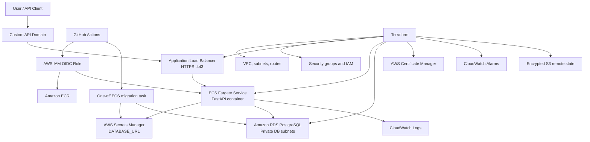

### Network and Security Flow

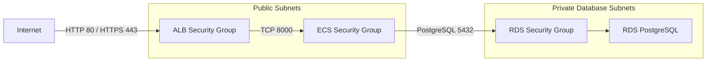

### CI/CD Deployment Flow

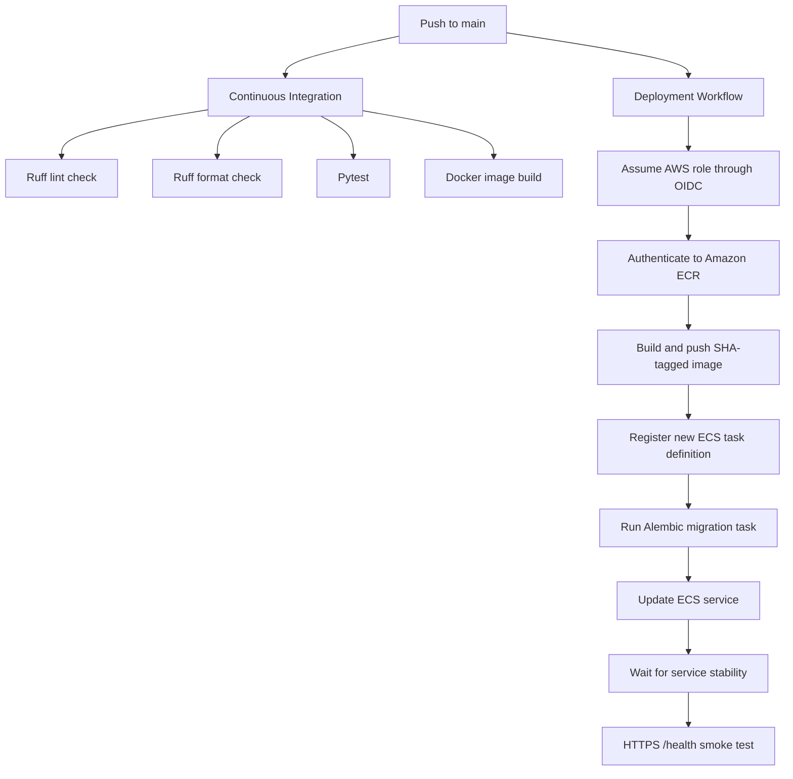

### Request Flow

```text
Client
  → Custom HTTPS domain
  → Application Load Balancer
  → ECS Fargate task
  → FastAPI application
  → RDS PostgreSQL
```

## Features

### Application

- Create, list, retrieve, update, and delete tasks.
- PostgreSQL-backed data persistence.
- Pydantic request validation.
- SQLAlchemy ORM.
- Health endpoint for application availability.
- Readiness endpoint for database connectivity.
- Interactive Swagger UI and ReDoc documentation.
- Security response headers middleware.

### Containerization

- Python 3.12 slim base image.
- Application runs as a non-root container user.
- Built-in Docker health check.
- Docker Compose environment for local API and PostgreSQL development.
- Persistent local PostgreSQL volume.

### Infrastructure

- Modular Terraform architecture.
- S3 remote Terraform state.
- Two public subnets across two Availability Zones.
- Two private database subnets.
- Public Application Load Balancer.
- ECS Fargate service.
- Private RDS PostgreSQL instance.
- Amazon ECR repository.
- AWS Secrets Manager integration.
- ACM certificate and HTTPS listener.
- CloudWatch log group and alarms.

### CI/CD

- Automated Ruff linting and format verification.
- Automated Pytest execution.
- Docker image build verification.
- AWS authentication through OIDC.
- Immutable SHA-based Docker image tags.
- Automated ECS task-definition registration.
- Automated Alembic migrations.
- ECS service stability check.
- HTTPS smoke test after deployment.

## Technology Stack

| Area | Technology |
|---|---|
| Backend | Python 3.12, FastAPI |
| API server | Uvicorn |
| Validation | Pydantic |
| ORM | SQLAlchemy |
| Database | PostgreSQL |
| Database service | Amazon RDS |
| Migrations | Alembic |
| Testing | Pytest, FastAPI TestClient |
| Linting and formatting | Ruff |
| Containerization | Docker, Docker Compose |
| Container registry | Amazon ECR |
| Container runtime | Amazon ECS Fargate |
| Load balancing | Application Load Balancer |
| Infrastructure as Code | Terraform |
| CI/CD | GitHub Actions |
| AWS authentication | GitHub Actions OIDC |
| Secrets | AWS Secrets Manager |
| Logging and monitoring | Amazon CloudWatch |
| TLS certificate | AWS Certificate Manager |
| DNS | External DNS provider |
| Terraform state | Amazon S3 |

## Repository Structure

```text
.
├── .github/
│   └── workflows/
│       ├── ci.yml                    # Linting, tests, and Docker build
│       └── deploy.yml                # AWS ECS deployment workflow
├── app/
│   ├── __init__.py
│   ├── config.py                     # Application configuration
│   ├── crud.py                       # Database CRUD operations
│   ├── database.py                   # SQLAlchemy configuration
│   ├── main.py                       # FastAPI application entry point
│   ├── middleware.py                 # Security response headers
│   ├── models.py                     # SQLAlchemy models
│   ├── routes.py                     # Task API routes
│   └── schemas.py                    # Pydantic request and response models
├── docs/
│   └── screenshots/                  # Public-safe project screenshots
├── migrations/
│   ├── versions/                     # Alembic migration revisions
│   ├── env.py
│   └── script.py.mako
├── scripts/
│   ├── start-dev.ps1                 # Start RDS and ECS
│   └── stop-dev.ps1                  # Pause ECS and RDS
├── terraform/
│   ├── bootstrap/                    # S3 remote-state bootstrap
│   ├── environments/
│   │   └── dev/                      # Development environment
│   └── modules/
│       ├── database/
│       ├── ecs/
│       ├── load-balancer/
│       ├── monitoring/
│       ├── networking/
│       └── security/
├── tests/
│   ├── test_health.py
│   └── test_tasks.py
├── .env.example
├── alembic.ini
├── docker-compose.yml
├── Dockerfile
├── requirements.txt
├── requirements-dev.txt
└── README.md
```

## API Documentation

### Endpoints

| Method | Endpoint | Success response | Description |
|---|---|---:|---|
| `GET` | `/` | `200` | Return application metadata |
| `GET` | `/health` | `200` | Confirm that FastAPI is running |
| `GET` | `/ready` | `200` | Confirm PostgreSQL connectivity |
| `POST` | `/tasks` | `201` | Create a task |
| `GET` | `/tasks` | `200` | List all tasks |
| `GET` | `/tasks/{task_id}` | `200` | Retrieve one task |
| `PUT` | `/tasks/{task_id}` | `200` | Partially update a task |
| `DELETE` | `/tasks/{task_id}` | `204` | Delete a task |
| `GET` | `/docs` | `200` | Open Swagger UI |
| `GET` | `/redoc` | `200` | Open ReDoc |

### Task Data Model

| Field | Create request | Update request | Validation |
|---|---|---|---|
| `title` | Required | Optional | String, 1–200 characters |
| `description` | Optional | Optional | String or `null` |
| `status` | Optional | Optional | String, 1–50 characters; default `pending` |
| `priority` | Optional | Optional | String, 1–50 characters; default `medium` |
| `id` | Generated | Not accepted | Integer |
| `created_at` | Generated | Not accepted | Timestamp |

`status` and `priority` are currently validated as bounded strings rather than
fixed enumerations.

### Example Create Request

```json
{
  "title": "Deploy application to ECS",
  "description": "Run the FastAPI application on AWS Fargate",
  "status": "pending",
  "priority": "high"
}
```

### Example Response

```json
{
  "title": "Deploy application to ECS",
  "description": "Run the FastAPI application on AWS Fargate",
  "status": "pending",
  "priority": "high",
  "id": 1,
  "created_at": "2026-07-22T10:18:20.264197Z"
}
```

### Common HTTP Responses

| Status | Meaning |
|---:|---|
| `200` | Request completed successfully |
| `201` | Task created successfully |
| `204` | Task deleted successfully |
| `404` | Requested task does not exist |
| `422` | Request payload failed validation |
| `500` | Application or database operation failed |

## Quick Start

### Clone the Repository

```powershell
git clone https://github.com/ridhampansara27/aws-ecs-terraform-task-manager.git
cd aws-ecs-terraform-task-manager
```

### Configure the Local Environment

```powershell
Copy-Item .env.example .env
```

The Docker Compose environment uses the PostgreSQL service name `db`:

```text
DATABASE_URL=postgresql+psycopg://taskuser:local-development-password@db:5432/taskmanager
```

Do not commit `.env`.

### Start PostgreSQL

```powershell
docker compose up -d db
```

### Build the API and Apply Migrations

```powershell
docker compose build api
docker compose run --rm api python -m alembic upgrade head
```

### Start the Application

```powershell
docker compose up -d api
```

Open:

- <http://localhost:8000/>
- <http://localhost:8000/docs>
- <http://localhost:8000/health>
- <http://localhost:8000/ready>

### Try the API

Create a task:

```bash
curl --request POST \
  --url http://localhost:8000/tasks \
  --header "Content-Type: application/json" \
  --data '{
    "title": "Review ECS deployment",
    "description": "Verify the new task definition",
    "status": "pending",
    "priority": "high"
  }'
```

List tasks:

```bash
curl http://localhost:8000/tasks
```

Retrieve task `1`:

```bash
curl http://localhost:8000/tasks/1
```

Update task `1`:

```bash
curl --request PUT \
  --url http://localhost:8000/tasks/1 \
  --header "Content-Type: application/json" \
  --data '{
    "status": "completed"
  }'
```

Delete task `1`:

```bash
curl --request DELETE http://localhost:8000/tasks/1
```

## Local Development

### Local Prerequisites

Install:

- Git
- Python 3.12
- Docker Desktop
- Docker Compose

AWS CLI and Terraform are only required for AWS infrastructure operations.

### Python Virtual Environment

```powershell
python -m venv .venv
.venv\Scripts\Activate.ps1
python -m pip install --upgrade pip
python -m pip install -r requirements-dev.txt
```

### Run Application Quality Checks

```powershell
python -m ruff check .
python -m ruff format --check .
python -m pytest -v
```

To automatically format the Python files:

```powershell
python -m ruff format .
```

### Test Coverage Scope

The automated test suite currently verifies:

- Application metadata response.
- Health endpoint behavior.
- Task creation.
- Task listing.
- Missing-task `404` responses.
- Task updates.
- Task deletion.

The tests use an isolated in-memory SQLite database for task CRUD operations.

### Generate a Database Migration

After changing the SQLAlchemy models:

```powershell
docker compose build api
docker compose run --rm -v "${PWD}/migrations:/app/migrations" api python -m alembic revision --autogenerate -m "describe change"
```

Always review an autogenerated migration before applying it.

### Stop Local Containers

```powershell
docker compose down
```

To also delete the local PostgreSQL volume:

```powershell
docker compose down -v
```

Use `-v` only when local database data should be permanently removed.

## Terraform Deployment

### Cloud Deployment Prerequisites

Install and configure:

- Terraform `1.10.0` or newer.
- AWS CLI v2.
- Docker.
- An AWS CLI profile with appropriate permissions.
- Access to the DNS provider for the API domain.
- A GitHub repository with Actions enabled.
- Repository variables required by the deployment workflow.

The development environment uses:

- AWS region: `eu-central-1`
- Environment: `dev`
- Project name: `task-manager`
- API domain: `api.ridham-pansara-portfolio.online`

Forks or reused deployments must replace the repository owner, repository ID,
repository name, domain name, and other account-specific configuration.

### AWS Profile

```powershell
$env:AWS_PROFILE = "terraform-developer"
```

Do not use AWS root-account access keys.

Confirm the active identity:

```powershell
aws sts get-caller-identity
```

### Bootstrap Remote State

The bootstrap stack creates the S3 bucket used for Terraform state.

```powershell
cd terraform\bootstrap
terraform init
terraform fmt -check
terraform validate
terraform plan
terraform apply
```

Do not destroy the bootstrap stack while another Terraform environment still
uses its state bucket.

Return to the repository root:

```powershell
cd ..\..
```

### Validate the Development Configuration

```powershell
cd terraform\environments\dev
terraform init
terraform fmt -check -recursive
terraform validate
terraform plan
```

Terraform configuration requirements:

- Terraform `>= 1.10.0`
- AWS provider `~> 6.0`
- Random provider `~> 3.7`

### Initial ECR Image Bootstrap

The base ECS task definition expects an image tagged:

```text
sha-initial
```

For a new AWS account or a clean deployment, create the ECR repository first:

```powershell
terraform apply -target=aws_ecr_repository.app
```

Read the ECR URL:

```powershell
$EcrUri = terraform output -raw ecr_repository_url
$Registry = ($EcrUri -split "/")[0]
```

Authenticate Docker to ECR:

```powershell
aws ecr get-login-password `
  --region eu-central-1 |
docker login `
  --username AWS `
  --password-stdin $Registry
```

Build and push the initial image:

```powershell
docker build -t "${EcrUri}:sha-initial" .
docker push "${EcrUri}:sha-initial"
```

The GitHub Actions deployment workflow will use immutable
`sha-<commit-sha>` image tags for subsequent deployments.

### Deploy the Development Environment

```powershell
terraform plan
terraform apply
```

Useful outputs:

```powershell
terraform output
terraform output -raw ecr_repository_url
terraform output -raw alb_dns_name
terraform output -raw ecs_cluster_name
terraform output -raw ecs_service_name
terraform output -raw ecs_security_group_id
terraform output -raw github_deploy_role_arn
```

### Configure GitHub Repository Variables

Open:

```text
Repository
  → Settings
  → Secrets and variables
  → Actions
  → Variables
```

Add:

| Variable | Example |
|---|---|
| `AWS_REGION` | `eu-central-1` |
| `AWS_ROLE_ARN` | Terraform `github_deploy_role_arn` output |
| `ECR_REPOSITORY` | `task-manager-api` |
| `ECS_CLUSTER` | `task-manager-dev-cluster` |
| `ECS_SERVICE` | `task-manager-dev-service` |
| `ECS_TASK_DEFINITION` | `task-manager-dev` |
| `ECS_SUBNETS` | `subnet-abc,subnet-def` |
| `ECS_SECURITY_GROUP` | `sg-abc123` |
| `ALB_DNS` | `api.ridham-pansara-portfolio.online` |

No long-lived AWS access keys are stored in GitHub.

### Terraform and CI/CD Ownership Boundary

Terraform manages:

- VPC and subnet configuration.
- Security groups.
- Application Load Balancer.
- ECS cluster and base service.
- ECS IAM roles.
- RDS PostgreSQL.
- Secrets Manager.
- CloudWatch resources.
- ECR.
- ACM.
- GitHub OIDC role.

GitHub Actions manages application image revisions after the base ECS service
has been created.

The ECS service ignores later task-definition changes from Terraform:

```hcl
lifecycle {
  ignore_changes = [
    task_definition
  ]
}
```

This prevents a later `terraform apply` from replacing a GitHub Actions
deployment with the older Terraform-defined image revision.

## CI/CD Pipeline

### Continuous Integration

Workflow:

```text
.github/workflows/ci.yml
```

Triggers:

- Pushes to `main`.
- Pull requests targeting `main`.

Current jobs:

1. Check out the source code.
2. Install Python 3.12.
3. Install development dependencies.
4. Run Ruff lint checks.
5. Verify Ruff formatting.
6. Run Pytest.
7. Build the Docker image.
8. Inspect the built image.

### Continuous Deployment

Workflow:

```text
.github/workflows/deploy.yml
```

Trigger:

- Push to `main`.

Deployment sequence:

```text
Checkout source
  → Assume AWS role through GitHub OIDC
  → Authenticate to Amazon ECR
  → Build Docker image
  → Push immutable SHA-tagged image
  → Download the current ECS task definition
  → Replace the application image
  → Register a new ECS task-definition revision
  → Run Alembic as a one-off ECS task
  → Verify migration exit code
  → Update the ECS service
  → Wait for ECS service stability
  → Run an HTTPS /health smoke test
```

The workflow uses a deployment concurrency group so that development
deployments do not execute concurrently.

### Recommended Additional CI Quality Gates

The following checks are not currently part of the active CI workflow and are
planned improvements:

- `terraform fmt -check -recursive`
- `terraform init -backend=false`
- `terraform validate`
- Checkov or Trivy Terraform scanning
- Trivy Docker image vulnerability scanning
- Python dependency vulnerability scanning
- Test coverage reporting with `pytest-cov`

These checks should only be documented as active after they are added to the
workflow and pass successfully.

## Security

Implemented security controls:

- HTTPS is enabled for the API domain.
- HTTP port `80` redirects to HTTPS port `443`.
- RDS is not publicly accessible.
- RDS runs in private database subnets.
- RDS accepts port `5432` only from the ECS security group.
- ECS accepts port `8000` only from the ALB security group.
- Database credentials are generated automatically.
- Database credentials are stored in AWS Secrets Manager.
- The ECS execution role reads only the required database secret.
- GitHub Actions uses AWS OIDC instead of long-lived credentials.
- The GitHub deploy role is restricted to the configured repository and branch.
- ECR image tags are immutable.
- ECS uses separate task and execution roles.
- The ECS deployment circuit breaker is enabled.
- Terraform state is stored in a private, encrypted, versioned S3 bucket.
- The container runs as a non-root user.
- CloudWatch log retention is configured.
- Sensitive values are excluded from public documentation screenshots.

Application responses include:

- `X-Content-Type-Options`
- `X-Frame-Options`
- `Referrer-Policy`
- `Permissions-Policy`

### Development Security Trade-Off

To avoid the cost of a NAT Gateway, ECS tasks run in public subnets with public
IP assignment.

This does not make the application container publicly reachable because its
security group accepts inbound traffic only from the Application Load Balancer
security group.

A more production-oriented version would place ECS tasks in private subnets and
use either:

- A NAT Gateway.
- VPC endpoints for ECR, CloudWatch, Secrets Manager, S3, and related services.

## Database Migrations

Alembic manages database schema changes.

Current migration history includes:

- Creation of the initial `tasks` table.
- Addition of the `priority` field.

### Local Migration

```powershell
docker compose run --rm api python -m alembic upgrade head
```

### AWS Migration

Before updating the ECS service, GitHub Actions starts a one-off ECS Fargate task
with this command:

```text
python -m alembic upgrade head
```

The deployment continues only when the migration container exits with code `0`.

This approach:

- Runs migrations once per deployment.
- Prevents every application container from attempting migrations.
- Ensures that the new application revision is deployed only after successful
  schema migration.
- Uses the same Docker image for application code and migration code.

### Migration Compatibility

Database migrations should remain backward compatible whenever possible.

Recommended deployment pattern:

1. Add new nullable columns or compatible structures.
2. Deploy code that supports both the old and new schema.
3. Backfill or migrate data.
4. Remove deprecated structures in a later deployment.

Destructive schema changes should not be combined with an application
deployment unless a tested recovery plan exists.

## Monitoring and Logging

Application logs are written to:

```text
/ecs/task-manager-dev
```

Tail recent logs:

```powershell
aws logs tail "/ecs/task-manager-dev" `
  --region eu-central-1 `
  --since 15m `
  --follow
```

Configured CloudWatch alarms include:

- ECS high CPU utilization.
- ECS high memory utilization.
- ALB HTTP 5xx responses.
- Unhealthy ALB targets.

Useful operational checks:

```powershell
aws ecs describe-services `
  --cluster task-manager-dev-cluster `
  --services task-manager-dev-service `
  --region eu-central-1
```

```powershell
aws elbv2 describe-target-health `
  --target-group-arn <target-group-arn> `
  --region eu-central-1
```

## Backup and Recovery

The development RDS configuration currently uses:

| Setting | Development value |
|---|---|
| Storage encryption | Enabled |
| Automated backup retention | 1 day |
| Multi-AZ | Disabled |
| Deletion protection | Disabled |
| Final snapshot on Terraform destroy | Disabled |
| Automatic minor-version upgrades | Enabled |

These settings prioritize low cost and rapid experimentation rather than
production-grade data protection.

### Important Data-Loss Warning

Running `terraform destroy` can delete the development RDS database without
creating a final snapshot.

Before destroying an environment that contains important data, create a manual
snapshot:

```powershell
aws rds create-db-snapshot `
  --db-instance-identifier task-manager-dev-postgres `
  --db-snapshot-identifier task-manager-dev-manual-backup `
  --region eu-central-1
```

Check snapshot status:

```powershell
aws rds describe-db-snapshots `
  --db-snapshot-identifier task-manager-dev-manual-backup `
  --region eu-central-1
```

For a production environment, recommended changes include:

- Enable deletion protection.
- Require a final snapshot.
- Increase backup retention.
- Enable Multi-AZ.
- Add cross-region backup or snapshot-copy policies.
- Test database restoration procedures.

## Deployment Rollback

### ECS Application Rollback

List recent task-definition revisions:

```powershell
aws ecs list-task-definitions `
  --family-prefix task-manager-dev `
  --sort DESC `
  --region eu-central-1
```

Deploy a known working revision:

```powershell
aws ecs update-service `
  --cluster task-manager-dev-cluster `
  --service task-manager-dev-service `
  --task-definition task-manager-dev:<previous-revision> `
  --region eu-central-1
```

Wait for the service to become stable:

```powershell
aws ecs wait services-stable `
  --cluster task-manager-dev-cluster `
  --services task-manager-dev-service `
  --region eu-central-1
```

Verify:

```powershell
curl.exe --fail https://api.ridham-pansara-portfolio.online/health
```

### Automatic ECS Rollback

The ECS deployment circuit breaker is configured to detect failed deployments
and roll the service back when new tasks cannot become healthy.

### Database Rollback

Application rollback and database rollback are separate operations.

Before using an Alembic downgrade:

1. Confirm that the downgrade revision exists.
2. Review whether it removes columns or data.
3. Create an RDS snapshot.
4. Test the downgrade in a non-production environment.
5. Confirm that the previous application version supports the downgraded schema.

Example:

```powershell
docker compose run --rm api python -m alembic downgrade -1
```

Forward-compatible migrations are preferred because a destructive database
downgrade may cause permanent data loss.

## HTTPS and Custom Domain

The API is available through:

```text
https://api.ridham-pansara-portfolio.online
```

HTTPS is implemented with:

- ACM certificate in `eu-central-1`.
- DNS validation through the external DNS provider.
- ALB HTTPS listener on port `443`.
- HTTP-to-HTTPS redirect on port `80`.
- CNAME record from the API subdomain to the ALB DNS name.

The ACM DNS-validation record should remain configured so that AWS can
automatically renew the certificate.

## Cost Optimization

The development environment is designed for a student AWS account with limited
credits.

Implemented cost controls:

- No NAT Gateway.
- One ECS Fargate application task.
- Small Single-AZ RDS instance.
- RDS storage autoscaling limited to a small maximum.
- ECS can be scaled to zero.
- RDS can be temporarily stopped.
- CloudWatch log retention is limited.
- ECR lifecycle rules remove old images.
- Multi-AZ RDS is disabled.
- AWS WAF is not enabled.
- Container Insights is not enabled.
- Production autoscaling is not enabled.

Resources that may continue to incur charges even when ECS and RDS compute are
paused:

- Application Load Balancer.
- RDS storage.
- RDS backups and snapshots.
- S3 Terraform state storage.
- CloudWatch logs.
- ECR image storage.
- Public IPv4-related charges.
- Route or DNS-provider charges, where applicable.

## Start and Stop Scripts

The repository contains PowerShell scripts for cost-controlled operation.

### Start the Development Runtime

```powershell
.\scripts\start-dev.ps1
```

The script:

1. Starts the RDS instance.
2. Waits for RDS to become available.
3. Scales the ECS service to one task.

### Stop the Development Runtime

```powershell
.\scripts\stop-dev.ps1
```

The script:

1. Scales the ECS service to zero.
2. Waits for running ECS tasks to stop.
3. Stops the RDS instance.

These scripts do not destroy the AWS infrastructure.

The Application Load Balancer, networking resources, RDS storage, ECR images,
CloudWatch data, and Terraform state remain provisioned.

## Screenshots

Screenshots are stored under:

```text
docs/screenshots/
```

Sensitive values such as account IDs, ARNs, database endpoints, private IP
addresses, subnet IDs, secret identifiers, and other account-specific data are
blurred before publication.

### Application and API

| Swagger API Documentation | HTTPS Health Check |
|---|---|
| [](docs/screenshots/01-swagger-docs.png) | [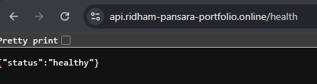](docs/screenshots/02-https-health.png) |

| Task CRUD Response |
|---|
| [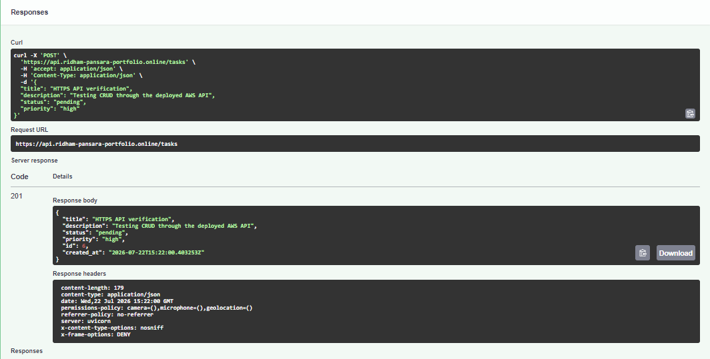](docs/screenshots/03-task-crud-response.png) |

### Continuous Integration and Deployment

| GitHub CI Success | GitHub Deployment Success |
|---|---|
| [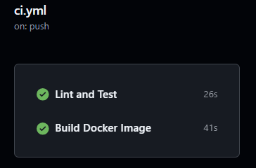](docs/screenshots/04-github-ci-success.png) | [](docs/screenshots/05-github-deploy-success.png) |

### AWS Runtime and Security

| ECS Service Running | ALB Target Healthy |
|---|---|
| [](docs/screenshots/06-ecs-service-running.png) | [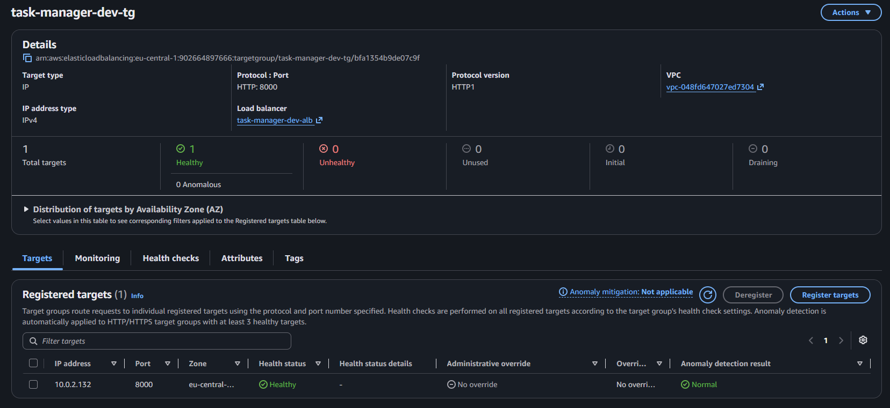](docs/screenshots/07-alb-target-healthy.png) |

| RDS Private Configuration | Secrets Manager Configuration |
|---|---|
| [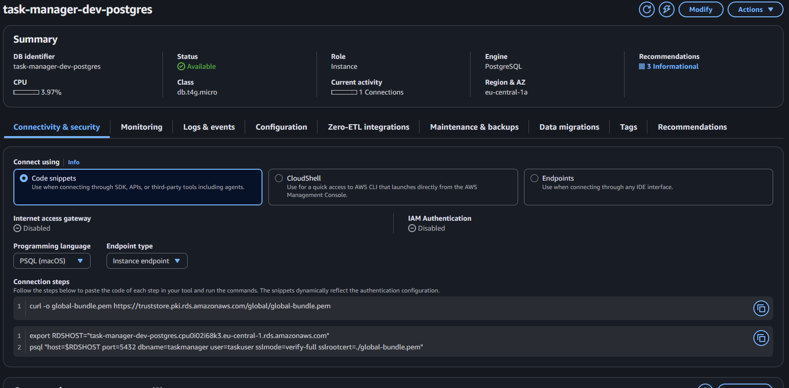](docs/screenshots/08-rds-private-config.png) | [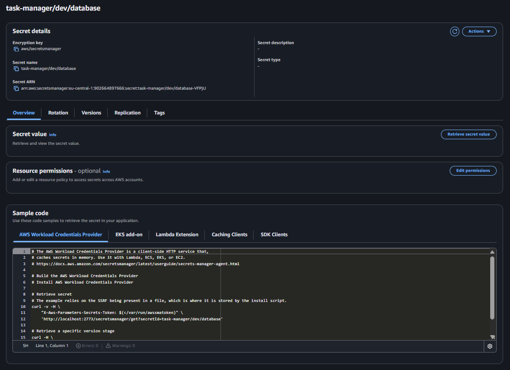](docs/screenshots/09-secrets-manager-database.png) |

### Monitoring and Infrastructure

| CloudWatch Logs | CloudWatch Alarms |
|---|---|
| [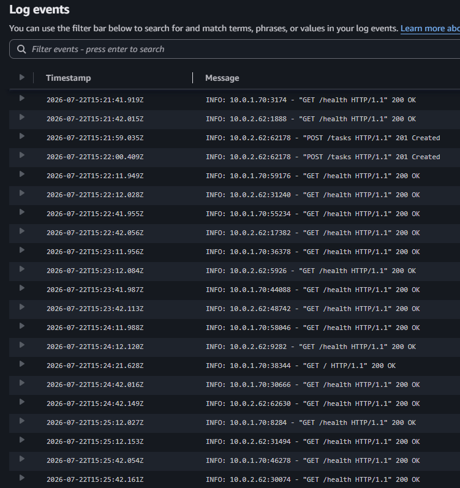](docs/screenshots/10-cloudwatch-logs.png) | [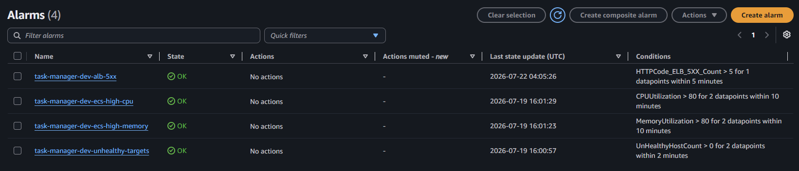](docs/screenshots/11-cloudwatch-alarms.png) |

| Terraform Outputs | ACM Certificate Issued |
|---|---|
| [](docs/screenshots/12-terraform-outputs.png) | [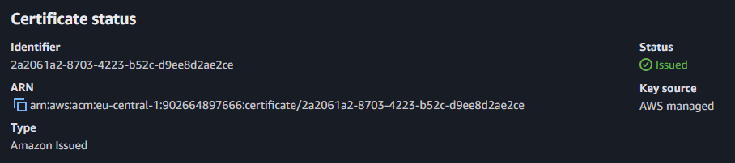](docs/screenshots/13-acm-certificate-issued.png) |

Select any screenshot to open it at full size.

Never publish:

- AWS access keys.
- Secret values.
- Database passwords.
- Private `.env` files.
- Full Terraform state.
- Unblurred AWS account IDs.
- Sensitive resource identifiers.

## Current Limitations

This repository demonstrates production-inspired engineering patterns, but the
current deployment is intentionally a development environment.

Current limitations:

- RDS is Single-AZ.
- The ECS service runs one task by default.
- ECS tasks run in public subnets.
- The application does not implement authentication or authorization.
- Task `status` and `priority` are free-form strings.
- The list endpoint does not implement pagination.
- No API rate limiting is configured.
- AWS WAF is not enabled.
- ECS autoscaling is not configured.
- RDS deletion protection is disabled.
- Terraform destroy does not create a final RDS snapshot.
- Backup retention is limited to one day.
- No frontend user interface is included.
- No Terraform validation job is currently included in GitHub Actions.
- No container or Terraform security scanner is currently included in CI.
- Test coverage percentages are not currently published.
- No separate production Terraform environment exists.

## Troubleshooting

### Docker Cannot Connect to the Daemon

Start Docker Desktop and verify:

```powershell
docker info
```

### Docker Compose Database Is Not Healthy

Check container status:

```powershell
docker compose ps
```

Read PostgreSQL logs:

```powershell
docker compose logs db
```

Confirm that `.env` contains matching PostgreSQL database, username, password,
and `DATABASE_URL` values.

### PowerShell Cannot Find Pytest or Ruff

Activate the virtual environment:

```powershell
.venv\Scripts\Activate.ps1
```

Run tools through Python:

```powershell
python -m pytest
python -m ruff check .
```

### ECR Login Fails in PowerShell

Confirm the AWS identity and region:

```powershell
aws sts get-caller-identity
aws configure get region
```

When PowerShell piping causes login problems, run the login command in Command
Prompt:

```cmd
aws ecr get-login-password --profile terraform-developer --region eu-central-1 | docker login --username AWS --password-stdin <account-id>.dkr.ecr.eu-central-1.amazonaws.com
```

### Alembic Reports Invalid Interpolation Syntax

Database URLs can contain URL-encoded `%` characters.

The Alembic environment must escape `%` before passing the database URL to the
Alembic configuration.

### GitHub Actions Cannot Assume the AWS Role

Check:

- `AWS_ROLE_ARN` matches the Terraform output.
- The workflow includes `id-token: write`.
- The OIDC provider exists in AWS.
- The role trust policy matches the repository and branch.
- The configured immutable GitHub owner and repository IDs are correct.
- The workflow is running from the expected repository.

### ECS Migration Task Fails

Inspect logs:

```powershell
aws logs tail "/ecs/task-manager-dev" `
  --region eu-central-1 `
  --since 15m
```

Check the stopped task:

```powershell
aws ecs describe-tasks `
  --cluster task-manager-dev-cluster `
  --tasks <migration-task-arn> `
  --region eu-central-1
```

Confirm:

- The migration task uses the newly registered task definition.
- The image contains the Alembic files.
- The task can read the database secret.
- The ECS security group can connect to RDS.
- RDS is running and available.
- The migration container exit code is `0`.

### ECS Tasks Fail to Pull the Initial Image

Confirm that the ECR repository contains:

```text
sha-initial
```

List ECR images:

```powershell
aws ecr list-images `
  --repository-name task-manager-api `
  --region eu-central-1
```

### Terraform Attempts to Change the ECS Task Definition

GitHub Actions manages application task-definition revisions after the base
service exists.

The ECS service uses `ignore_changes` for `task_definition`, preventing
Terraform from rolling back a newer GitHub Actions deployment.

### Live API Is Unavailable

The cost-controlled environment may be paused.

Start it with:

```powershell
.\scripts\start-dev.ps1
```

Then verify:

```powershell
aws rds describe-db-instances `
  --db-instance-identifier task-manager-dev-postgres `
  --region eu-central-1
```

```powershell
aws ecs describe-services `
  --cluster task-manager-dev-cluster `
  --services task-manager-dev-service `
  --region eu-central-1
```

## Future Improvements

### Security and Compliance

- Add AWS WAF in front of the ALB.
- Add API authentication and authorization.
- Add rate limiting.
- Add Checkov or Trivy Terraform scanning.
- Add Trivy container image scanning.
- Add Dependabot for Python, Docker, Terraform, and GitHub Actions.
- Add secret scanning and CodeQL analysis.
- Pin GitHub Actions to immutable commit SHAs.

### Reliability

- Add Multi-AZ RDS for a production environment.
- Enable RDS deletion protection.
- Require final snapshots.
- Increase automated backup retention.
- Add RDS CPU, storage, connection, and free-memory alarms.
- Add SNS email notifications for alarms.
- Add ECS autoscaling.
- Add private ECS subnets with VPC endpoints or a NAT Gateway.
- Add automated rollback verification.
- Add a separate production environment.

### CI/CD

- Add Terraform formatting and validation to CI.
- Add Terraform plan output to pull requests.
- Add Docker image vulnerability scanning.
- Add Python dependency scanning.
- Add test coverage reporting and a minimum threshold.
- Add manual approval for production deployments.
- Add deployment environments and protected GitHub branches.

### Application

- Replace free-form status and priority strings with enums.
- Add task-list pagination.
- Add filtering and sorting.
- Add structured JSON application logging.
- Add request correlation IDs.
- Add API metrics.
- Add a frontend task-management interface.
- Export the OpenAPI specification to the documentation directory.

### Infrastructure

- Add Route 53 hosted-zone automation.
- Add separate `dev`, `staging`, and `prod` environments.
- Add VPC Flow Logs.
- Add CloudTrail monitoring.
- Add Terraform drift-detection workflows.
- Add budget and cost-anomaly alerts.

## License

This project is licensed under the MIT License.

See [LICENSE](LICENSE) for the full license text.
