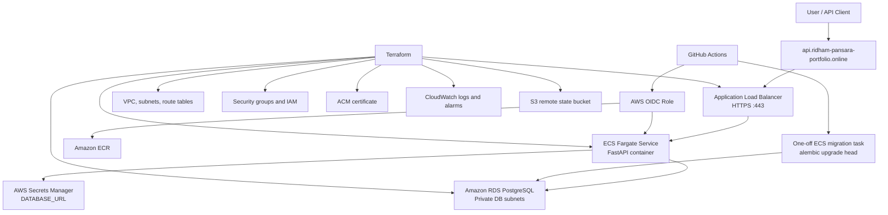
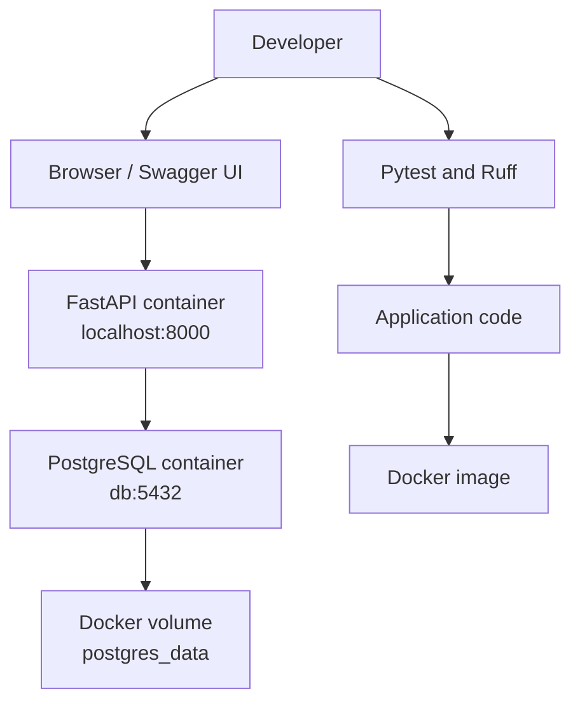
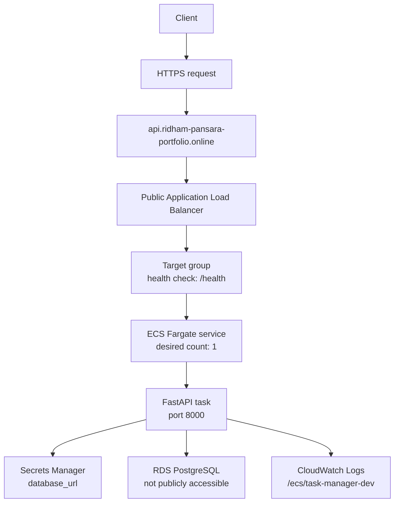
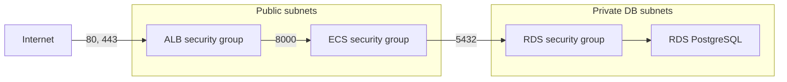
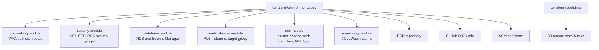
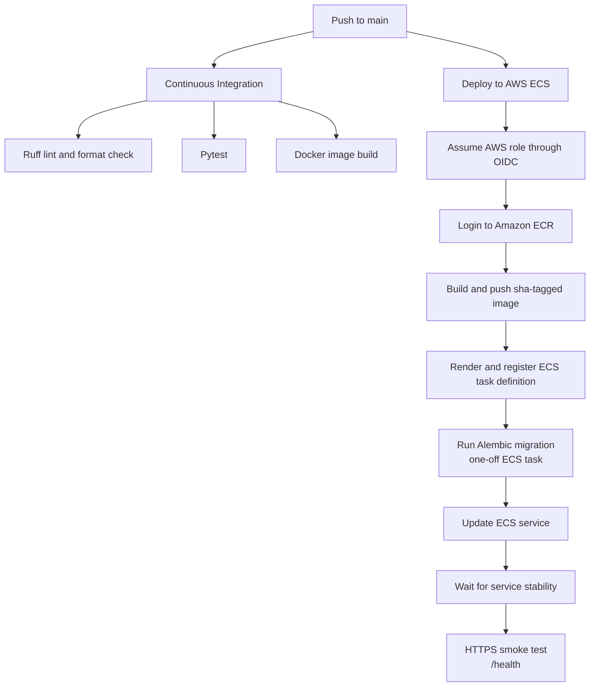
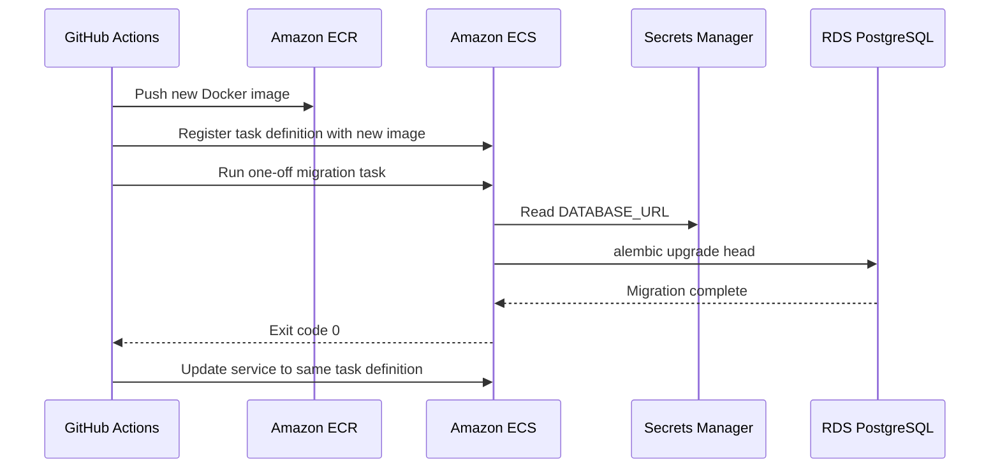

# Cloud-Native Task Manager on AWS

A production-style task management REST API deployed on AWS with Docker, ECS
Fargate, RDS PostgreSQL, Terraform, GitHub Actions OIDC, automated Alembic
migrations, CloudWatch monitoring, and HTTPS through a custom subdomain.

Live API:

- API root: <https://api.ridham-pansara-portfolio.online/>
- Swagger UI: <https://api.ridham-pansara-portfolio.online/docs>
- ReDoc: <https://api.ridham-pansara-portfolio.online/redoc>
- Health check: <https://api.ridham-pansara-portfolio.online/health>
- Readiness check: <https://api.ridham-pansara-portfolio.online/ready>

Note: this is a cost-controlled development environment. The ECS service and
RDS database may be stopped when the project is not being demonstrated.

## Overview

This project demonstrates how to build and operate a small cloud-native backend
application on AWS. The application itself is intentionally simple: it provides a
task management API with create, read, update, and delete operations.

The main goal is to show the full engineering workflow around a real deployable
service:

- REST API development with FastAPI.
- Relational persistence with PostgreSQL.
- Containerized deployment with Docker.
- Versioned database migrations with Alembic.
- Infrastructure as Code with Terraform.
- AWS networking, IAM, security groups, and managed services.
- CI/CD with GitHub Actions and AWS OIDC.
- Automated database migrations during deployment.
- HTTPS and custom API subdomain.
- CloudWatch logs and alarms.
- Cost-conscious start and stop workflow for a student AWS account.

## Project Phases

This project was built in phases so each layer could be tested before adding the
next one.

```mermaid
flowchart LR
    p1["Phase 1<br/>Local FastAPI API"] --> p2["Phase 2<br/>Docker and PostgreSQL"]
    p2 --> p3["Phase 3<br/>Alembic migrations"]
    p3 --> p4["Phase 4<br/>Terraform remote state and ECR"]
    p4 --> p5["Phase 5<br/>VPC, security groups, and RDS"]
    p5 --> p6["Phase 6<br/>ALB, ECS Fargate, and CloudWatch"]
    p6 --> p7["Phase 7<br/>GitHub Actions OIDC CI/CD"]
    p7 --> p8["Phase 8<br/>HTTPS custom domain"]
    p8 --> p9["Phase 9<br/>Operations, cost control, and documentation"]
```



| Phase | Outcome |
| --- | --- |
| Phase 1 | FastAPI CRUD API with health and readiness endpoints |
| Phase 2 | Dockerized API and local PostgreSQL with Docker Compose |
| Phase 3 | Alembic database migration workflow |
| Phase 4 | Terraform S3 remote state and ECR repository |
| Phase 5 | AWS VPC, public subnets, private DB subnets, security groups, RDS, and Secrets Manager |
| Phase 6 | Application Load Balancer, ECS Fargate service, CloudWatch logs, and alarms |
| Phase 7 | GitHub Actions CI/CD with OIDC, ECR push, ECS deployment, and automated migrations |
| Phase 8 | ACM HTTPS certificate and custom API subdomain |
| Phase 9 | README, screenshots, start/stop scripts, and portfolio documentation |

## Architecture

### Complete AWS Architecture



### Local Development Architecture



### AWS Runtime Architecture



### Network and Security Group Flow



### Terraform Module Architecture



### CI/CD Deployment Architecture



### Automated Database Migration Flow



### Cost-Control Runtime Flow

```mermaid
flowchart LR
    start["scripts/start-dev.ps1"] --> startdb["Start RDS"]
    startdb --> waitdb["Wait for RDS available"]
    waitdb --> startecs["Scale ECS desired count to 1"]
    startecs --> running["Demo environment running"]

    running --> stop["scripts/stop-dev.ps1"]
    stop --> scalezero["Scale ECS desired count to 0"]
    scalezero --> waitzero["Wait for running tasks = 0"]
    waitzero --> stopdb["Stop RDS"]
    stopdb --> paused["Lower-cost paused state"]
```



### Request Flow

```text
Client
  -> HTTPS custom domain
  -> Application Load Balancer
  -> ECS Fargate task
  -> FastAPI application
  -> RDS PostgreSQL
```

### Deployment Flow

```text
Push to main
  -> GitHub Actions CI
  -> Docker image build
  -> Push SHA-tagged image to ECR
  -> Register new ECS task definition
  -> Run Alembic migration as one-off ECS task
  -> Update ECS service
  -> Wait for service stability
  -> HTTPS smoke test
```

## Features

- Task CRUD API:
  - `POST /tasks`
  - `GET /tasks`
  - `GET /tasks/{task_id}`
  - `PUT /tasks/{task_id}`
  - `DELETE /tasks/{task_id}`
- Health endpoint for load balancer checks.
- Readiness endpoint for database connectivity checks.
- PostgreSQL-backed persistence.
- `priority` field managed through Alembic schema migration.
- Interactive API documentation through Swagger UI and ReDoc.
- Dockerized FastAPI application.
- Non-root container execution.
- Security response headers middleware.
- Automated tests with Pytest.
- Linting and formatting with Ruff.
- Automated GitHub Actions CI pipeline.
- Automated deployment pipeline with GitHub OIDC.
- Automated database migrations before ECS deployment.
- HTTPS through ACM and an external DNS-managed subdomain.

## Technology Stack

| Area | Technology |
| --- | --- |
| Backend | Python 3.12, FastAPI |
| API server | Uvicorn |
| Database | PostgreSQL |
| ORM | SQLAlchemy |
| Migrations | Alembic |
| Validation | Pydantic |
| Testing | Pytest, FastAPI TestClient |
| Linting and formatting | Ruff |
| Containerization | Docker, Docker Compose |
| Registry | Amazon ECR |
| Runtime | Amazon ECS Fargate |
| Load balancing | Application Load Balancer |
| Infrastructure | Terraform |
| CI/CD | GitHub Actions |
| AWS authentication | GitHub Actions OIDC |
| Secrets | AWS Secrets Manager |
| Monitoring | CloudWatch Logs and Alarms |
| HTTPS | AWS Certificate Manager |
| DNS | External domain provider CNAME records |

## AWS Infrastructure

The AWS infrastructure is managed with Terraform under:

```text
terraform/
|-- bootstrap/
|-- environments/
|   `-- dev/
`-- modules/
    |-- database/
    |-- ecs/
    |-- load-balancer/
    |-- monitoring/
    |-- networking/
    `-- security/
```

### Core AWS Services

| Service | Purpose |
| --- | --- |
| VPC | Isolated network for the application |
| Public subnets | ALB and cost-optimized ECS task placement |
| Private DB subnets | RDS PostgreSQL placement |
| Internet Gateway | Public internet routing for the ALB and public ECS tasks |
| Security Groups | Layered access control between ALB, ECS, and RDS |
| ECR | Private Docker image registry |
| ECS Fargate | Serverless container runtime |
| RDS PostgreSQL | Managed relational database |
| Secrets Manager | Stores database connection details |
| ALB | Public HTTPS entry point and health checks |
| ACM | TLS certificate for the API subdomain |
| CloudWatch Logs | ECS application logs |
| CloudWatch Alarms | CPU, memory, ALB 5xx, and unhealthy target monitoring |
| S3 | Remote Terraform state storage |
| IAM | Least-privilege roles for ECS and GitHub Actions |

### Network Design

| Layer | CIDR |
| --- | --- |
| VPC | `10.0.0.0/16` |
| Public subnet 1 | `10.0.1.0/24` |
| Public subnet 2 | `10.0.2.0/24` |
| Private DB subnet 1 | `10.0.21.0/24` |
| Private DB subnet 2 | `10.0.22.0/24` |

This development deployment intentionally avoids a NAT Gateway to reduce cost.
ECS tasks run in public subnets with public IPs, but their security group only
allows inbound application traffic from the ALB security group. RDS remains in
private database subnets and is not publicly accessible.

## Security

Security controls implemented in this project:

- HTTPS enabled for the custom API subdomain.
- HTTP port `80` redirects to HTTPS port `443`.
- RDS is not publicly accessible.
- RDS accepts PostgreSQL traffic only from the ECS security group.
- ECS accepts application traffic only from the ALB security group.
- ALB accepts public HTTP/HTTPS traffic.
- Database credentials are stored in AWS Secrets Manager.
- ECS task execution role reads only the required database secret.
- GitHub Actions uses OIDC instead of long-lived AWS access keys.
- GitHub deploy role trust policy is restricted to this repository and main branch.
- ECR image tags are immutable.
- ECS task runs with a separate execution role and task role.
- ECS deployment circuit breaker is enabled with rollback.
- CloudWatch log retention is configured.
- Terraform state is stored in a private, encrypted, versioned S3 bucket.
- Application responses include basic security headers:
  - `X-Content-Type-Options`
  - `X-Frame-Options`
  - `Referrer-Policy`
  - `Permissions-Policy`

## API Endpoints

| Method | Endpoint | Description |
| --- | --- | --- |
| `GET` | `/` | API metadata |
| `GET` | `/health` | Lightweight application health check |
| `GET` | `/ready` | Database readiness check |
| `GET` | `/tasks` | List all tasks |
| `GET` | `/tasks/{task_id}` | Get one task |
| `POST` | `/tasks` | Create a task |
| `PUT` | `/tasks/{task_id}` | Update a task |
| `DELETE` | `/tasks/{task_id}` | Delete a task |
| `GET` | `/docs` | Swagger UI |
| `GET` | `/redoc` | ReDoc documentation |

### Example Task Payload

```json
{
  "title": "Deploy application to ECS",
  "description": "Run the FastAPI application on AWS Fargate",
  "status": "pending",
  "priority": "high"
}
```

### Example Response

```json
{
  "title": "Deploy application to ECS",
  "description": "Run the FastAPI application on AWS Fargate",
  "status": "pending",
  "priority": "high",
  "id": 1,
  "created_at": "2026-07-22T10:18:20.264197Z"
}
```

## Local Development

### Prerequisites

Install:

- Python 3.12
- Docker Desktop
- Docker Compose
- Git
- AWS CLI v2
- Terraform

### Create the Python Environment

```powershell
python -m venv .venv
.venv\Scripts\Activate.ps1
python -m pip install --upgrade pip
python -m pip install -r requirements-dev.txt
```

### Configure Local Environment Variables

Copy the example environment file:

```powershell
Copy-Item .env.example .env
```

The local Docker Compose setup uses PostgreSQL through the `db` service name:

```text
DATABASE_URL=postgresql+psycopg://taskuser:local-development-password@db:5432/taskmanager
```

Do not commit `.env`.

### Start Locally

```powershell
docker compose up --build
```

Open:

- <http://localhost:8000/>
- <http://localhost:8000/docs>
- <http://localhost:8000/health>
- <http://localhost:8000/ready>

### Apply Local Migrations

```powershell
docker compose run --rm api python -m alembic upgrade head
```

### Generate a New Migration

After changing SQLAlchemy models:

```powershell
docker compose build api
docker compose run --rm -v "${PWD}/migrations:/app/migrations" api python -m alembic revision --autogenerate -m "describe change"
```

Review the generated file before applying it.

### Run Quality Checks

```powershell
python -m ruff format .
python -m ruff check .
python -m ruff format --check .
python -m pytest
```

### Stop Local Containers

```powershell
docker compose down
```

To remove local PostgreSQL data:

```powershell
docker compose down -v
```

Use `-v` only when you intentionally want to delete the local database volume.

## Terraform Deployment

### AWS Profile

The local Terraform workflow uses an AWS CLI profile:

```powershell
$env:AWS_PROFILE = "terraform-developer"
```

Do not use AWS root account access keys.

### Bootstrap Remote State

The bootstrap stack creates the S3 bucket used for Terraform remote state.

```powershell
cd terraform\bootstrap
terraform init
terraform fmt -recursive
terraform validate
terraform plan
terraform apply
```

Do not destroy the bootstrap stack while the environment still uses the state
bucket.

### Deploy the Development Environment

```powershell
cd terraform\environments\dev
$env:AWS_PROFILE = "terraform-developer"
terraform init
terraform fmt -recursive
terraform validate
terraform plan
terraform apply
```

Useful outputs:

```powershell
terraform output
terraform output -raw alb_dns_name
terraform output -raw ecs_cluster_name
terraform output -raw ecs_service_name
terraform output -raw github_deploy_role_arn
```

### Important Terraform and CI/CD Ownership Boundary

Terraform owns the base ECS infrastructure, IAM roles, networking, ALB, RDS, and
monitoring.

GitHub Actions owns application image deployment revisions after the base ECS
service exists. The ECS service uses:

```hcl
lifecycle {
  ignore_changes = [
    task_definition
  ]
}
```

This prevents Terraform from rolling the service back to an older image after a
GitHub Actions deployment.

## CI/CD Pipeline

### Continuous Integration

Workflow:

```text
.github/workflows/ci.yml
```

Runs on pushes and pull requests to `main`.

Jobs:

- Install Python dependencies.
- Run Ruff lint checks.
- Verify Ruff formatting.
- Run Pytest.
- Build the Docker image.

### Continuous Deployment

Workflow:

```text
.github/workflows/deploy.yml
```

Runs on pushes to `main`.

Deployment sequence:

```text
Checkout source
  -> Configure AWS credentials through GitHub OIDC
  -> Login to ECR
  -> Build Docker image
  -> Push image with sha-<commit-sha> tag
  -> Download current ECS task definition
  -> Render task definition with new image
  -> Register new ECS task definition
  -> Run Alembic migration as one-off ECS Fargate task
  -> Update ECS service to registered task definition
  -> Wait for ECS service stability
  -> Smoke test HTTPS /health endpoint
```

### GitHub Repository Variables

The deployment workflow expects these repository variables:

| Variable | Example |
| --- | --- |
| `AWS_REGION` | `eu-central-1` |
| `AWS_ROLE_ARN` | IAM role ARN from Terraform output |
| `ECR_REPOSITORY` | `task-manager-api` |
| `ECS_CLUSTER` | `task-manager-dev-cluster` |
| `ECS_SERVICE` | `task-manager-dev-service` |
| `ECS_TASK_DEFINITION` | `task-manager-dev` |
| `ECS_SUBNETS` | `subnet-abc,subnet-def` |
| `ECS_SECURITY_GROUP` | `sg-abc123` |
| `ALB_DNS` | `api.ridham-pansara-portfolio.online` |

No AWS access keys are stored in GitHub.

## HTTPS and Custom Domain

The API is served through:

```text
https://api.ridham-pansara-portfolio.online
```

HTTPS is implemented with:

- ACM certificate in `eu-central-1`.
- DNS validation through the external domain provider.
- ALB HTTPS listener on port `443`.
- HTTP listener redirecting port `80` to HTTPS.
- CNAME record from `api.ridham-pansara-portfolio.online` to the ALB DNS name.

The ACM validation CNAME should remain in DNS so the certificate can renew.

## Database Migrations

Alembic is used for schema versioning.

Current migration history includes:

- Initial `tasks` table.
- `priority` column added to tasks.

For local development:

```powershell
docker compose run --rm api python -m alembic upgrade head
```

For AWS deployment, GitHub Actions runs:

```text
python -m alembic upgrade head
```

as a one-off ECS Fargate task before updating the ECS service.

This avoids running migrations automatically in every application container and
prevents multiple tasks from attempting schema changes at the same time.

## Monitoring and Logs

Application logs are sent to:

```text
/ecs/task-manager-dev
```

Useful commands:

```powershell
aws logs tail "/ecs/task-manager-dev" --region eu-central-1 --since 15m
```

CloudWatch alarms include:

- ECS high CPU.
- ECS high memory.
- ALB 5xx responses.
- Unhealthy ALB targets.

## Cost Optimization

This project was designed for a student AWS account with limited credits.

Cost-saving decisions:

- No NAT Gateway in the development architecture.
- One ECS Fargate task for dev.
- Small Single-AZ RDS instance.
- ECS service can be scaled to zero when not in use.
- RDS can be stopped temporarily when not in use.
- CloudWatch log retention is limited.
- ECR lifecycle policy removes old images.
- No WAF, Multi-AZ RDS, Container Insights, or always-on production scaling in dev.

Main resources that continue to cost money while running:

- Application Load Balancer.
- ECS Fargate tasks.
- RDS instance compute when the database is running.
- RDS storage and backups.
- Public IPv4-related charges where applicable.

## Start and Stop Scripts

The repository includes scripts to reduce manual AWS CLI work.

Start the development runtime:

```powershell
.\scripts\start-dev.ps1
```

This starts RDS, waits until it is available, and scales ECS to one task.

Stop the development runtime:

```powershell
.\scripts\stop-dev.ps1
```

This scales ECS to zero, waits for tasks to stop, and stops RDS.

These scripts do not destroy infrastructure. They only pause the main runtime
resources to reduce cost.

## Screenshots

The screenshots below are public-safe documentation assets. Sensitive values
such as AWS account IDs, ARNs, VPC IDs, subnet IDs, private IP addresses,
database endpoints, and secret identifiers are blurred before publishing.

### 1. Swagger API Documentation


### 2. HTTPS Health Check


### 3. Task CRUD Response


### 4. GitHub CI Success


### 5. GitHub Deploy Success


### 6. ECS Service Running


### 7. ALB Target Healthy


### 8. RDS Private Configuration


### 9. Secrets Manager Database Secret


### 10. CloudWatch Logs


### 11. CloudWatch Alarms


### 12. Terraform Outputs


### 13. ACM Certificate Issued


Do not publish screenshots that expose AWS access keys, secret values, database
passwords, full Terraform state, private `.env` files, or unblurred AWS account
IDs.

## Troubleshooting

### Docker cannot connect to the daemon

Start Docker Desktop and verify:

```powershell
docker info
```

### PowerShell cannot find `pytest` or `ruff`

Activate the virtual environment:

```powershell
.venv\Scripts\Activate.ps1
```

Or run tools through Python:

```powershell
python -m pytest
python -m ruff check .
```

### ECR login fails in PowerShell

If PowerShell piping causes login issues, use Command Prompt:

```cmd
aws ecr get-login-password --profile terraform-developer --region eu-central-1 | docker login --username AWS --password-stdin <account-id>.dkr.ecr.eu-central-1.amazonaws.com
```

### Alembic fails with invalid interpolation syntax

The database URL may contain URL-encoded `%` characters. The Alembic environment
escapes `%` before setting `sqlalchemy.url`.

### GitHub OIDC cannot assume the AWS role

Check:

- `AWS_ROLE_ARN` matches `terraform output -raw github_deploy_role_arn`.
- The workflow has `id-token: write`.
- The IAM trust policy matches the GitHub repository subject.
- For newer repositories, immutable owner and repository IDs may be required in the OIDC `sub`.

### ECS migration task fails

Check the migration task logs:

```powershell
aws logs tail "/ecs/task-manager-dev" --region eu-central-1 --since 15m
```

Confirm the migration task definition uses the newly built image and the task has
network access to RDS.

### Terraform wants to change ECS task definition after GitHub deploy

This is expected if Terraform and GitHub Actions both try to manage application
image revisions. The ECS service uses `ignore_changes` for `task_definition` so
GitHub Actions can manage deployment revisions.

## Future Improvements

- Add SNS email notifications for CloudWatch alarms.
- Add RDS storage, CPU, and connection alarms.
- Add WAF in front of the ALB.
- Add private ECS subnets with NAT Gateway or VPC endpoints for a more production-like design.
- Add Route 53 hosted zone automation.
- Add separate `dev` and `prod` Terraform environments.
- Add autoscaling for ECS.
- Add structured JSON request logging.
- Add API authentication.
- Add rate limiting.
- Add frontend UI for task management.
- Add deployment rollback documentation.
- Add Checkov or Trivy Terraform security scanning.
- Add OpenAPI export to the documentation folder.

## Portfolio Summary

Project title:

```text
Cloud-Native Task Manager on AWS
```

Portfolio description:

```text
Designed and deployed a production-style REST API on AWS using ECS Fargate,
RDS PostgreSQL, Application Load Balancer, Terraform, GitHub Actions OIDC,
automated Alembic migrations, CloudWatch monitoring, ACM HTTPS, and a custom
API subdomain.
```

Key skills demonstrated:

- Infrastructure as Code with Terraform.
- AWS VPC, subnets, route tables, and security groups.
- Container deployment with ECS Fargate and ECR.
- PostgreSQL integration with RDS.
- Secret injection with AWS Secrets Manager.
- CI/CD automation with GitHub Actions.
- Secure AWS authentication with OIDC.
- Automated schema migrations with Alembic.
- HTTPS and custom domain configuration.
- Logging and monitoring with CloudWatch.
- Cost-aware AWS operations for a student environment.
